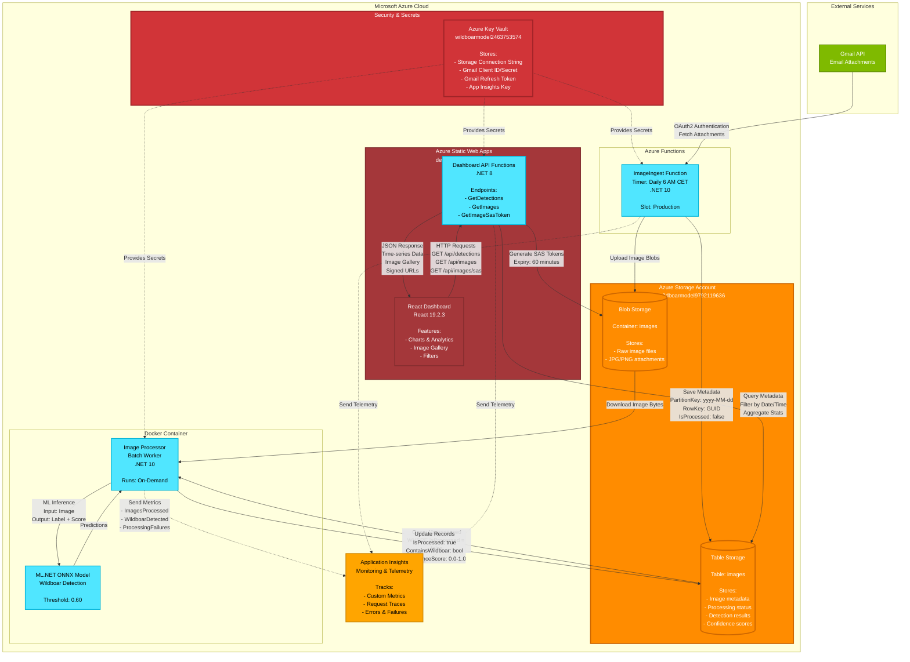
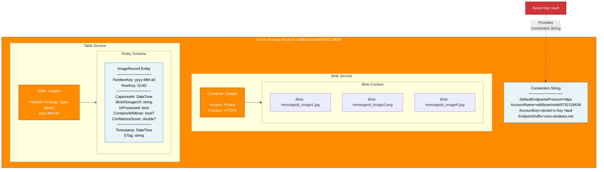
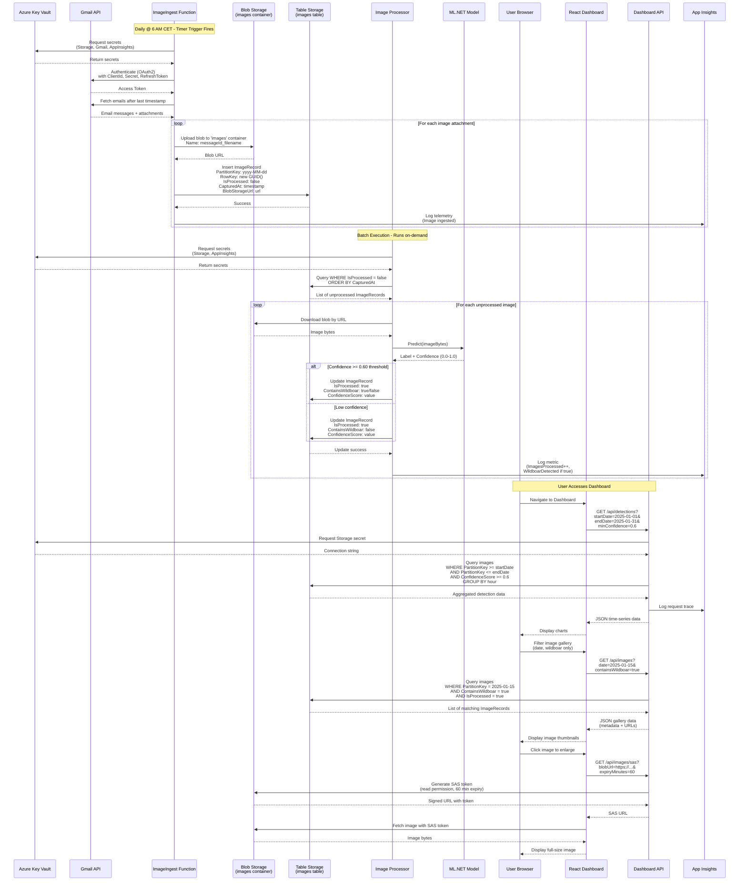
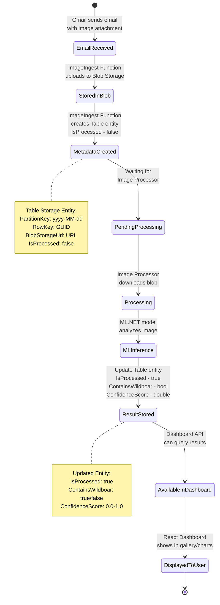
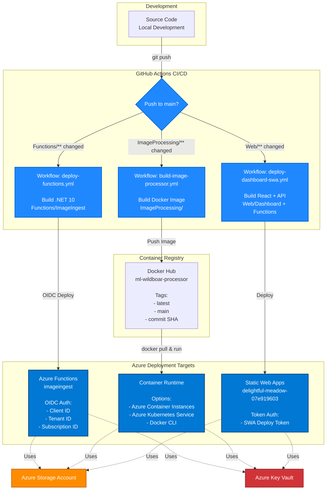
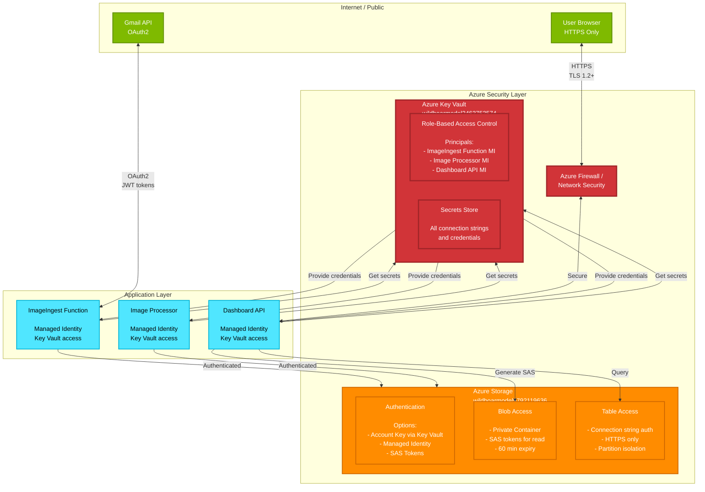
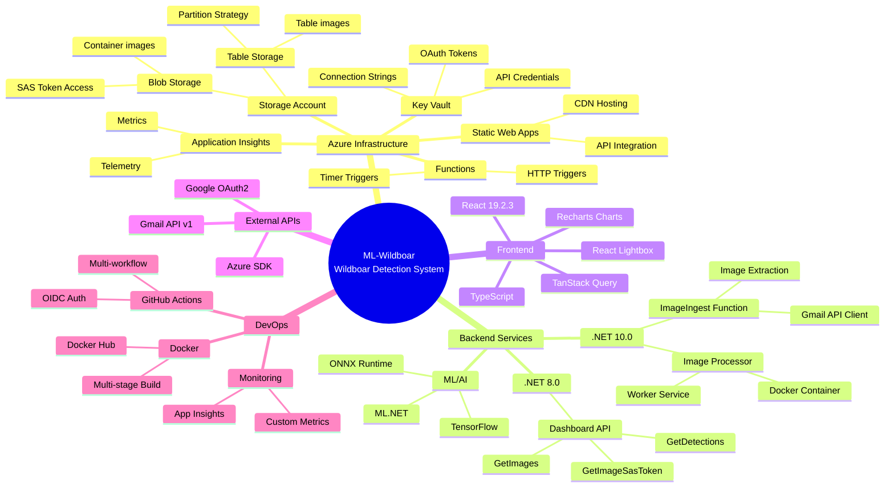

# Live-website

https://delightful-meadow-07e919603.1.azurestaticapps.net/

# ML-Wildboar Architecture

## System Overview Flowchart

## Storage Account Details

## Key Vault Secret Management

```mermaid
flowchart LR
    subgraph KeyVault["Azure Key Vault<br/>wildboarmodel2463753574.vault.azure.net"]
        subgraph Secrets["Stored Secrets"]
            StorageConn[AzureStorage--ConnectionString<br/><br/>Value: DefaultEndpoints...]
            GmailClient[Gmail--ClientId<br/><br/>Value: Google OAuth Client ID]
            GmailSecret[Gmail--ClientSecret<br/><br/>Value: Google OAuth Secret]
            GmailRefresh[Gmail--RefreshToken<br/><br/>Value: OAuth Refresh Token]
            AppInsKey[ApplicationInsights--ConnectionString<br/><br/>Value: InstrumentationKey=...]
        end
    end

    subgraph Apps["Applications"]
        Ingest[ImageIngest Function<br/><br/>Needs:<br/>- Storage Connection<br/>- Gmail Credentials<br/>- App Insights]
        Processor[Image Processor<br/><br/>Needs:<br/>- Storage Connection<br/>- App Insights]
        DashAPI[Dashboard API<br/><br/>Needs:<br/>- Storage Connection<br/>- App Insights]
    end

    StorageConn -.->|Read at Startup| Ingest
    StorageConn -.->|Read at Startup| Processor
    StorageConn -.->|Read at Startup| DashAPI

    GmailClient -.->|OAuth| Ingest
    GmailSecret -.->|OAuth| Ingest
    GmailRefresh -.->|Token Refresh| Ingest

    AppInsKey -.->|Telemetry| Ingest
    AppInsKey -.->|Telemetry| Processor
    AppInsKey -.->|Telemetry| DashAPI

    classDef vault fill:#d13438,stroke:#a02428,stroke-width:3px,color:#fff
    classDef secret fill:#ffd6d8,stroke:#d13438,stroke-width:1px,color:#000
    classDef app fill:#50e6ff,stroke:#00b4d8,stroke-width:2px,color:#000

    class KeyVault vault
    class StorageConn,GmailClient,GmailSecret,GmailRefresh,AppInsKey secret
    class Ingest,Processor,DashAPI app
```

## Detailed Component Interactions

## Data Lifecycle

## Deployment Pipeline

## Security Architecture

## Technology Stack

